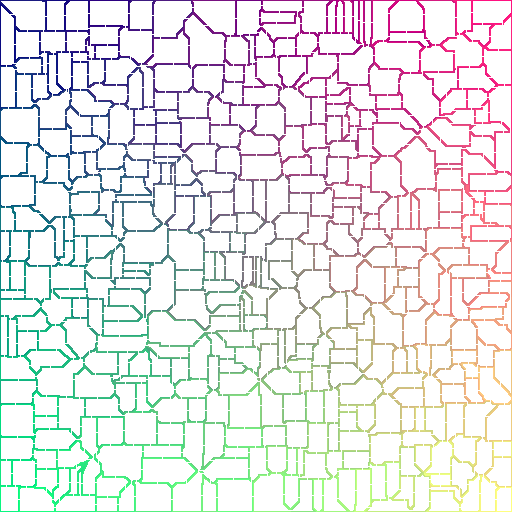
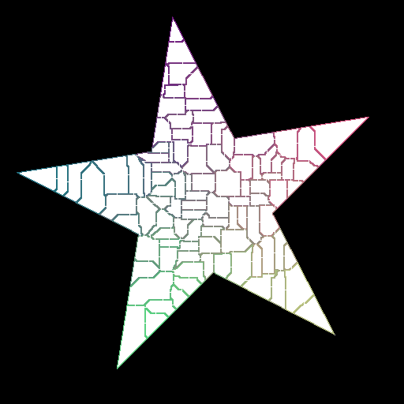

# DungeonBuilder
A really simple dungeon generator in javascript.

---

##Basic Usage

Let's say you simply want to fill a rectangle with wiggly rooms:

		var mapSpec = { width: 512, height: 512 };
		DungeonBuilder.build(mapSpec, {

			roomGridSize: 30,
			wiggle: 1,
			frequency: 0.5,

			done: function (resultCanvas, harness, roomInfo) {
				// add to document so we can see results
				document.body.appendChild(resultCanvas);
			}
		});
		

Produces:

Now let's say you want your dungeon to respect a general shape, but want the rooms to fill that shape. Simply provide an image (as an URL, an HTMLImageElement or an Image object). 

 - "open" space where the dungeon can exist should be transparent
 - blocked off space where the dungeon can't exist should be opaque.
 
		var mapSpec = "dungeon-boundary.png'
		// or it can refer to an image in the DOM
		mapSpec = document.getElementById("dungeonBoundary"); 
		
		DungeonBuilder.build(mapSpec, {
		
			roomGridSize: 30,
			wiggle: 2,
			frequency: 0.5,
		
			done: function (resultCanvas, harness, roomInfo) {	
				document.body.appendChild(resultCanvas);
			}
		});

Produces:

##Documentation

DungeonBuilder ultimately provides two sets of data. A `canvas` with the dungeon rendered in it, and a `roomInfo` object (see below) which is useful for traversing the canvas to make collision shapes, etc.

The key aspect of how DungeonBuilder works is to do with the color palette of the rendered image. Each room in the rendered image has a unique color associated with it, and that room's walls are in that color. The non-occupied space of the dungeon is black, and the "floor" area is white.

`DungeonBuilder.build` takes two parameters:

 - `mapSpec`: can be an URL, an Image, an HTMLImageElement, or a `Size` in the form of `{ width:, height: }`. 
 - `params`:
 	- `roomGridSize`: {number} - the space is divided up into a grid of cells. If you pass 10, you will get 100 cells for potential rooms.
 	- `wiggle`: {number} [0 to 1] - room "seed" placement is wiggled randomly by the room's potential size by a random perturbation scaled by the wiggle factor. The larger the wiggle, the more random the seed placement will be.
 	- `frequency`: {number} [0 to 1] - with a value of 1, all "seeds" that are planted to create rooms will become rooms. With a value less than 1, the odds of a seed "taking root" are reduced. Lowering the frequency increases the randomness of the generated dungeon.
 	- `rng`: {function} - optional - a function which returns a random number from 0 to 1. This allows you to provide your own RNG for repeatable dungeon generation.
 	- `done`: {function} - invoked when the dungeon generation has completed.
 	  
 	  
The `done` callback signature is as follows:
`done(canvas, harness, roomInfo)`

- `canvas`: {HTMLCanvasElement} - the HTML canvas where the dungeon has been rendered
- `harness`: {DungeonBuilder.Harness} - a wrapper for HTMLCanvasElement which provides simple and direct pixel setting/getting
- `roomInfo`: {object} provides information useful for turning the rendered dungeon bitmap into whatever form you need for your purpose.

The `roomInfo` object looks like the following:

 - `floorColor`: the color used to render walkable spaces
 - `voidColor`: the color used to depict the area *outside* the dungeon
 - `rooms`: array of the following:
 	- `bounds`: rect describing the room's location on the canvas
 	- `color`: the color of the room's walls
 		
 You may want to use this data to generate collision shapes or to to pathfinding, etc. For example:
 
 
		DungeonBuilder.build(myMap, {
		
			roomGridSize: 20,
			wiggle: 0.5,
			frequency: 0.5,
		
			done: function (resultCanvas, harness, roomInfo) {	

				for (var i = 0; i < roomInfo.rooms.length; i++) {
					var room = roomInfo.rooms[i];
					for (var y = room.bounds.y; y < room.bounds.y + room.bounds.height; y++) {
						for (var x = room.bounds.x; x < room.bounds.x + room.bounds.width; x++) {
												
							if (harness.checkPixelColor(x,y,room.color) {
								// if this pixel has the room's wall color, add a collider here
								addWall(x,y)
							} else if (harness.checkPixelColor(x,y,roomInfo.floorColor) {
								// if this pixel is the floor, add to walkable space used by pathfinder
								addToAStarPathfinderWalkableSpace(x,y);
							}
						}
					}
				}
			}
		}); 	
 
 That's it!
